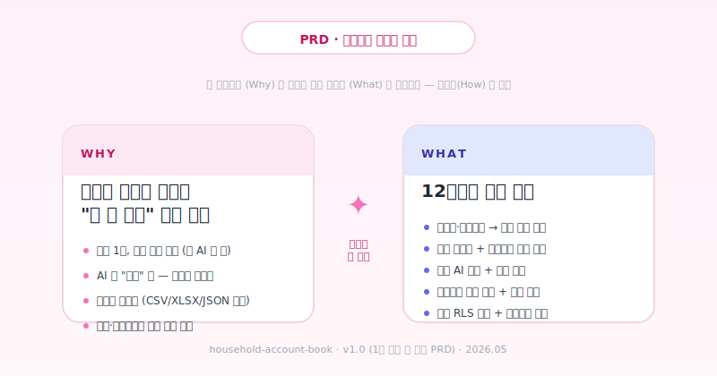
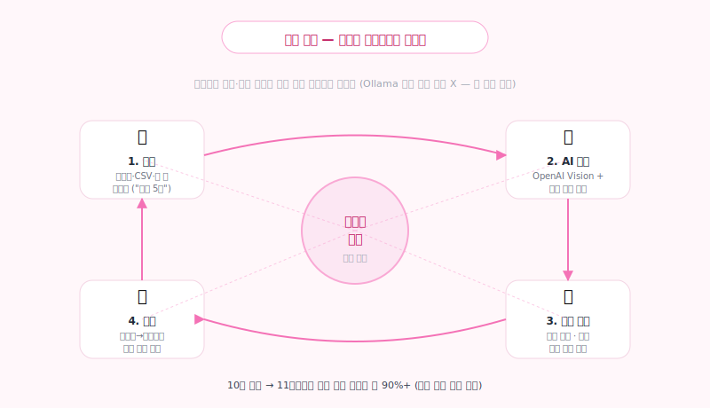
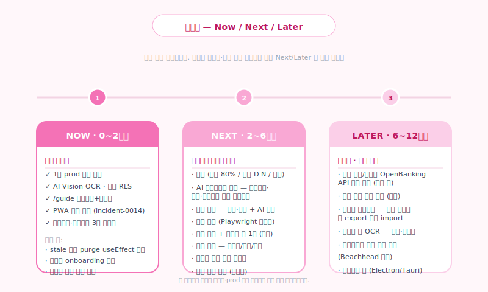

# 가계부 PRD — 목적과 방향 (Why & What)

> **PRD 의 역할** — "왜 이 가계부를 만드는가" 와 "12개월 안에 무엇이 되어야 하는가"
> 까지만 담는다. "어떻게 만드는가(How)" 는 별도 설계 문서 (`docs/ARCHITECTURE.md`,
> `docs/API_DESIGN.md`, `docs/DATABASE_SCHEMA.md` 등) 에서 다룬다.

---

## 1. Why — 왜 이 가계부인가

한국에는 이미 여러 가계부 앱이 있다. 그럼에도 이 프로젝트가 존재하는 이유:

| 문제 | 기존 시장 | 이 가계부의 답 |
|---|---|---|
| **매일 적기가 부담** | 카테고리·결제수단·금액 입력 폼이 무거움 | 헤더 ✨ / `Ctrl+K` 한 줄 자연어. `스벅 5천` → 후보 카드. |
| **AI 가 다 해주는 척** | 자동 분류했다고 해놓고 사용자가 못 고침 | AI 는 *후보* 만 만든다. 승인된 행만 거래내역에 들어간다. |
| **데이터를 인질** | 다른 앱으로 못 옮김 | CSV / XLSX(7시트) / JSON 백업. 언제든 떠날 수 있다. |
| **혼자만 쓰는 가계부** | 부부·가족 공유는 별도 비즈니스 플랜 | 모임(`households`) + RLS 격리. 컨텍스트 전환기로 개인 ↔ 모임. |
| **앱스토어 의존** | 심사·결제·노출 종속 | PWA. 홈 화면 추가 시 풀스크린. 즉시 배포. |

> 가이드 페이지 `/guide` 의 한 줄을 인용:
> *"가계부는 기록이 목표가 아니라, 내 돈이 어디로 가는지 알기 위한 도구"*

이 PRD 의 모든 의사결정은 위 문장에 충실하도록 정렬된다. 기록의 풍부함보다
**다음 행동을 만드는 통찰**이 우선이다.

---

## 2. Vision — 학습 루프

핵심 메커니즘은 **사용자의 승인·수정 패턴이 다음 분석 정확도가 되는 루프**:

1. **입력** — 영수증 사진 / CSV·XLSX (비번 자동 풀이) / 한 줄 자연어
2. **AI 추정** — OpenAI Vision 1차 분석 + 학습 규칙으로 보정
3. **후보 검토** — 안전한 행 일괄 승인 / 중복 의심 일괄 거부
4. **학습** — 가맹점 → 카테고리 자동 매핑 갱신, 사용자 수정 로그 누적

10건 승인 시점에서 11번째부터 자주 가는 가맹점은 자동 분류 정확도 90%+ 를
목표로 한다 (Ollama 시절 vs OpenAI Vision 전환 후 baseline 측정 필요).

> 주의: Ollama 로컬 LLM 학습은 하지 않는다. 학습은 **앱 내부 규칙(가맹점·카테고리·
> 결제수단 매핑)** 으로 한정. 모델 fine-tuning 은 비용·복잡도·privacy 측면에서
> out-of-scope.

---

## 3. 페르소나

### A. 민지 — 26세, 1인가구, 대기업 신입사원
- **JTBD**: "월급 들어오면 한 달 만에 통장이 비는 이유를 보고 싶다"
- **상황**: 모바일이 80%, 데스크톱이 20%. 영수증은 보통 카카오페이 알림으로 옴.
- **핵심 동선**: 잠들기 전 1~2분 / 헤더 ✨ 에 `오늘 점심 9천 카드` → 자동 분류 →
  주말에 한 번 통계 확인.
- **성공 신호**: 첫 30일 동안 평균 일일 입력 횟수 ≥ 1.0, 월말 회고 페이지 1회 이상.

### B. 준호 + 소영 — 결혼 1년 차 부부
- **JTBD**: "둘이 합쳐 어디서 돈이 새는지 한눈에 보고 싶다"
- **상황**: 따로 카드 쓰지만 같은 통장. 카카오톡으로 영수증 사진 주고받음.
- **핵심 동선**: 모임 만들고 초대코드 공유 → 컨텍스트 전환기로 "우리집" 모임에서
  거래 입력 → 월말 통계는 모임 단위.
- **성공 신호**: 모임 가입 후 30일 내 두 멤버 모두 ≥ 5건 입력, 월말 통계 페이지
  ≥ 1회 진입.

### C. (검토 중) 박사장 — 동네 카페 사장
- **JTBD**: "간이영수증·매출만 빠르게 정리. 회계사한테 정식으로 넘기기 전 단계."
- **현재 가설**: 자영업자용 간단 회계 모드를 LATER 단계에서 검토. 우선순위 낮음
  — 베이스 리텐션이 충분히 확보된 후 Beachhead 후보로 재평가.

---

## 4. Current Product — 지금 동작하는 핵심 화면

PRD 의 핵심 12 화면. 사용자가 실제 prod 에서 만나는 흐름.

| # | 화면 | 한 줄 |
|---|---|---|
| 1 | [월 캘린더](../public/guide/usage/01-calendar.svg) | 매일 진입 — 일별 지출/수입 + 카테고리 합산 남은 예산 |
| 2 | [AI 영수증](../public/guide/usage/02-ocr.svg) | 사진 한 장 → OpenAI Vision 으로 가맹점·금액·카테고리 추정 |
| 3 | [CSV/XLSX import](../public/guide/usage/03-import.svg) | 은행파일 그대로. 비번 걸린 XLSX 도 자동 해독 |
| 4 | [분석 후보 일괄 승인](../public/guide/usage/04-candidates.svg) | 안전한 행 일괄 승인 / 중복 의심 일괄 거부 |
| 5 | [예산 한도](../public/guide/usage/05-budget.svg) | 카테고리별, 80% 경고색. 카드 클릭 시 거래 펼침 |
| 6 | [고정 거래](../public/guide/usage/06-recurring.svg) | 월급·구독료. 자동 입력 + 사전 N일 알림 |
| 7 | [통계 + AI 회고](../public/guide/usage/07-stats.svg) | 6개월 흐름 + 인사이트 + AI 자동 요약 |
| 8 | [모임](../public/guide/usage/08-household.svg) | 가족·룸메이트와 가계부 공유. 컨텍스트 전환기. |
| 9 | [백업](../public/guide/usage/09-export.svg) | CSV / XLSX(7시트) / JSON. 데이터는 내 것. |

이 화면들은 `public/guide/usage/` 의 SVG mockup 으로 가이드 페이지(`/guide`) 의
"사용법" 탭과 동일 컨텐츠를 PRD 에서도 그대로 사용한다.

---

## 5. Roadmap — Now / Next / Later

### NOW (0~2개월) — 핵심 안정화

이미 prod 에 있는 것들이 정상 동작하는지 보장. 새 기능보다 incident 후속.

- ✅ 1차 prod 배포 (incident-0014, 2026-05-08)
- ✅ AI Vision OCR (Ollama → OpenAI Vision 전환, commit `b974ee6`/`654889c`)
- ✅ 모임 + RLS 격리
- ✅ `/guide` 작성요령 + 사용법 두 탭 (PR #6, #7)
- ✅ PWA 캐시 정책 (incident-0014 후속, PR #7)
- ✅ 카테고리·결제수단 3열 그리드 + 카드 세로 레이아웃 (PR #8, #10)
- 🔲 stale 캐시 purge useEffect 제거 (1~2주 후 — `images-cache-purged-2026-05-10`)
- 🔲 로그인 → 첫 진입 onboarding 정돈
- 🔲 모바일 (375px) 시각 회귀 한 번 점검 — 카드 좁아짐, 헤더 가로 스크롤 등

### NEXT (2~6개월) — 유지율을 만드는 가치

베타 사용자 인터뷰에서 "한 달 후 다시 안 들어가는 이유" 1위 가 보이면 그게 NEXT
의 1순위가 된다.

- **알림** — 예산 80% 도달 / 고정거래 D-N 일 / 모임에 새 거래. 푸시 + 인앱.
- **AI 어시스턴트 확장** — 현재 거래 추가·페이지 이동 → 카테고리·예산·고정거래
  *등록* 까지 자연어로. (`이번달 식비 30만원 한도` → 예산 카드 자동 생성)
- **통계 깊이** — 분기·연간 + 세금 시즌 대비 자동 정리.
- **시각 회귀 자동화** — Playwright 스냅샷 (디자인 변경 PR 마다 차이만 리뷰).
- **다크 모드** — 토큰 기반 (`textPrimary`, `pageBackground` 등) 이미 준비됨.
- **다국어 (영어)** — 일단 1개. i18n 라이브러리 도입 검토.
- **모임 권한** — 관리자 / 편집 / 조회 3단계.
- **영수증 일괄 업로드** — 한 번에 5~10장 드롭 → 후보로 묶음.

### LATER (6~12개월) — 차별화 · 검토 단계

순서·범위 고정 X. NEXT 진행하며 사용자 시그널로 결정.

- **외부 은행/카드사 OpenBanking API 직접 연동** — 파일 업로드 대체. 진짜 가치
  포인트지만 인증·법규·운영 비용 큼. 검토 단계.
- **자녀 용돈 서브 계정** — 모임 안 sub-context. 가족형 사용자 시그널 보고 결정.
- **다른 가계부 export 파일 import** — Mvelopes, 뱅크샐러드 등.
- **영수증 외 OCR** — 송장·견적서. 자영업자 모드 진입점.
- **자영업자 간단 회계 모드** — 박사장 페르소나의 Beachhead 진입 가설.
- **데스크톱 앱** — Electron 또는 Tauri. PWA 의 한계 (파일시스템·트레이) 있을 때.

이 로드맵은 분기로 자르지 않는다. 가계부는 일상 도구라 프로젝트 일정보다
**사용자 피드백 사이클**이 훨씬 강한 신호다.

---

## 6. 성공 지표 (Metrics)

PRD 단계에서는 *방향* 만 정한다. 정확한 베이스라인은 1차 배포 후 30일 데이터로
잡는다.

| 영역 | 지표 | 목표 (1차 배포 +90일) |
|---|---|---|
| **Activation** | 가입 후 7일 내 거래 ≥ 3건 입력 | 60% 이상 |
| **Retention** | 가입 후 30일 시점 주 1회 이상 진입 | 40% 이상 |
| **AI 정확도** | 학습 규칙 적용 후 카테고리 자동 매핑 정확도 (사용자 미수정 비율) | 85% 이상 |
| **모임 침투** | 가입자 중 모임 1개 이상 보유 | 25% 이상 |
| **PWA 설치** | 모바일 가입자 중 홈 화면 추가 | 30% 이상 |
| **백업 사용** | 월 1회 이상 CSV/XLSX/JSON export | 10% 이상 (낮아도 가치 — "떠날 수 있는 옵션" 자체가 신뢰) |

---

## 7. 비기능 요구사항

### Privacy
- 카드/계좌 번호는 **끝 4자리만** 저장.
- OCR 원문(영수증 raw text) 은 분석 후 **자동 폐기** (cron `/api/admin/purge-raw-text`,
  매일 18:00 KST).
- 사용자별 RLS 격리 (`auth.uid() = user_id`). 모임은 `households` + 멤버십 테이블
  로 격리. 25개 RLS 정책 자동 검증 (`npm run smoke:rls`).
- 영수증 원본 이미지: Supabase Storage private 버킷 `receipts`, 일정 기간 후 삭제.

### Performance
- 모바일 첫 진입 LCP ≤ 2.5s (저가 안드로이드 + LTE 기준).
- AI Vision 응답 평균 ≤ 8s (네트워크 + OpenAI 평균).
- 캘린더 페이지: 한 달 거래 1,000건까지 클라이언트 렌더 60fps 유지.

### Availability
- prod alias 갱신: 매 push 마다 자동 promote 검증 ("Verify alias after every
  push" 운영 룰).
- PWA Service Worker: 4xx 응답을 캐시하지 않음 (`cacheableResponse: { statuses:
  [0, 200] }`). incident-0014 후속.

### Security
- Supabase Service Role Key 는 절대 클라이언트 노출 X.
- OpenAI API Key 는 서버 라우트에서만 사용.
- CSP, HSTS, Referrer-Policy 등 표준 헤더는 Vercel 기본 + middleware 보강.

---

## 8. Out of Scope (이번 12개월에 안 함)

명시적으로 "안 한다" 고 적는 것이 PRD 의 절반이다.

- **자체 모델 fine-tuning** — Ollama gemma 자체 학습은 시도했다가 안정성·비용
  문제로 OpenAI Vision 으로 전환. 다시 가지 않는다.
- **암호화폐·주식 트래킹** — 가계부는 *현금흐름* 이지 *자산 관리* 가 아니다.
- **세금 신고 자동화** — 자영업자 모드 검토 단계에서나 다시 본다.
- **광고 / 인앱 결제** — 운영 모델 결정 전. 데이터 신뢰가 깨지는 첫 걸음이라
  매우 신중히.
- **B2B SaaS 변환** — Beachhead 가 아직 자영업자 페르소나로 굳지 않았다.

---

## Appendix A — 변경 이력 (PR #5~#10)

| PR | 제목 | PRD 영향 |
|---|---|---|
| [#5](https://github.com/hu28035036-ux/household-account-book/pull/5) | 캘린더 카테고리 합산 자동화 | 별도 전체 예산 입력 단계 제거 — 입력 마찰 ↓ (Activation 개선 가설) |
| [#6](https://github.com/hu28035036-ux/household-account-book/pull/6) | 가이드 탭 분리 | 사용법(How) 와 작성요령(보편 원칙) 분리 — onboarding 효율 ↑ |
| [#7](https://github.com/hu28035036-ux/household-account-book/pull/7) | 사용법 SVG 9개 + PWA 캐시 안정화 | 가이드 시각 자료 완성 + 4xx stale 캐시 사고 영구 차단 |
| [#8](https://github.com/hu28035036-ux/household-account-book/pull/8) | 카테고리·결제수단 3열 grid | 카드 정보 밀도 ↑ |
| [#10](https://github.com/hu28035036-ux/household-account-book/pull/10) | 카드 세로 레이아웃 + 크기 축소 | #8 부작용(텍스트 잘림) 해결 — 정보 밀도와 가독성 동시 확보 |

---

## Appendix B — 관련 문서

- 아키텍처 / 설계 — [`docs/ARCHITECTURE.md`](ARCHITECTURE.md), [`docs/API_DESIGN.md`](API_DESIGN.md), [`docs/DATABASE_SCHEMA.md`](DATABASE_SCHEMA.md)
- 보안·프라이버시 — [`docs/SECURITY_PRIVACY_RULES.md`](SECURITY_PRIVACY_RULES.md)
- AI 흐름 — [`docs/AI_EXTRACTION_FLOW.md`](AI_EXTRACTION_FLOW.md), [`docs/OCR_FLOW.md`](OCR_FLOW.md)
- 도메인 — [`docs/BUDGETS.md`](BUDGETS.md), [`docs/HOUSEHOLDS.md`](HOUSEHOLDS.md), [`docs/IMPORT_CSV_XLSX.md`](IMPORT_CSV_XLSX.md)
- 셋업 — [`docs/SETUP_GUIDE.md`](SETUP_GUIDE.md), [`docs/SUPABASE_SETUP.md`](SUPABASE_SETUP.md), [`docs/VERCEL_DEPLOYMENT_PLAN.md`](VERCEL_DEPLOYMENT_PLAN.md)
- README — [`README.md`](../README.md)
